  

  

  
  
  

  

---

## This is me :)

Hi, I'm **Akshat**, a B.Tech engineering student who builds AI-powered products. I like taking machine learning fundamentals and turning them into working software that solves real problems.

- 🏆 **Hackathon & Ideathon winner** at college level, and I've competed in several district, national and big private hackathons
- 🔍 Built **CryptoTrace**: an AI blockchain fraud-analytics platform that cut manual investigation from 2-3 weeks to under 10 minutes
- 🧠 Obsessed with **Generative AI, LLMs, and explainable AI**: making model decisions understandable to humans
- 🎙️ Working with **speech-to-text (Whisper)** to turn Hindi and regional-language voice into structured data
- 🌱 **Mission:** build technology that reaches people who are usually left out of the digital world
- 💬 Talk to me about **AI/ML, LLM apps, and building under hackathon pressure**

---

## my perfect stack

  

---

## signals

<table align="center">
  <tr>
    <td></td>
    <td></td>
  </tr>
</table>

---

## projects

| Project | What it does | Stack |
|---|---|---|
| **CryptoTrace** | Blockchain fraud-analytics platform. LLaMA-3.3-70B gives plain-language fraud-risk reasoning, Whisper turns voice complaints into structured data in under 2 minutes, and graph heuristics flag fraud-linked wallets from multi-hop transactions. | Python · Groq · Whisper · Graph ML |
| **Rural Hart** | Platform connecting rural artisans directly to customers, designed for non-technical users. | Full-stack web |
| **BingeBolt** | Cross-platform movie discovery app with live film data. | React Native · TMDB API |
| **AI-Powered Apps** | End-to-end ML applications, from data handling to model-driven output. | Python · ML |

---

## Numbers matter? ohhh yes.

  

  
  

